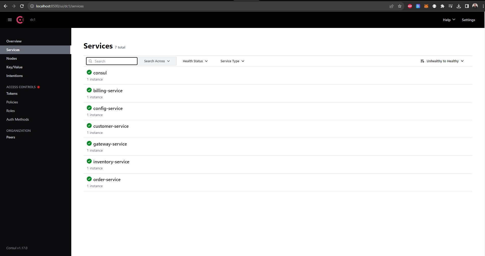

# Architecure-Microservice-avec-Spring-Cloud
# Spring Cloud Microservices Architecture for E-Commerce

## Overview
Welcome to our microservices-based e-commerce application! This project leverages various technologies, including Consul Discovery, Spring Cloud Config, Spring Cloud Gateway, Angular, and other specialized services.

## Architecture


### 1. CONFIG SERVICE
#### Consul Registered Services:


### 2. CUSTOMER-SERVICE
#### Entity Customer
```java
@Entity
@Data @NoArgsConstructor @AllArgsConstructor @Builder
public class Customer {
    @Id @GeneratedValue(strategy = GenerationType.IDENTITY)
    private Long id;
    private String name;
    private String email;
}

#### Repository CustomerRepository
```java
@RepositoryRestResource
public interface CustomerRepository extends JpaRepository<Customer, Long> {
}

#### Data Test
```java
@Bean
CommandLineRunner start(CustomerRepository customerRepository) {
    return args -> {
        customerRepository.saveAll(List.of(
            Customer.builder().name("Mohamed").email("med@gmail.com").build(),
            Customer.builder().name("Hassan").email("hasan@gmail.com").build(),
            Customer.builder().name("IMane").email("imane@gmail.com").build()
        ));
        customerRepository.findAll().forEach(System.out::println);
    };
}

#### Customer Service Test


### 3. GATEWAY-SERVICE
#### Bean Configuration


#### Gateway Configuration


#### Gateway Test


### 4. INVENTORY-SERVICE
#### Entity Product
```java
@Entity
@Data @NoArgsConstructor @AllArgsConstructor @Builder
public class Product {
    @Id @GeneratedValue(strategy = GenerationType.IDENTITY)
    private Long id;
    private String name;
    private double price;
    private int quantity;
}

#### Repository ProductRepository
```java
@RepositoryRestResource
public interface ProductRepository extends JpaRepository<Product, Long> {
}

#### Data Test
```java
@Bean
CommandLineRunner start(ProductRepository productRepository) {
    return args -> {
        Random random = new Random();
        for (int i = 1; i < 10; i++) {
            productRepository.saveAll(List.of(
                Product.builder()
                    .name("Laptop " + i)
                    .price(1200 + Math.random() * 10000)
                    .quantity(1 + random.nextInt(200)).build()
            ));
        }
    };
}

#### Inventory Service Test


### 5. ORDER-SERVICE
#### Entity Order
```java
@Entity
@Table(name="orders")
@Data @NoArgsConstructor @AllArgsConstructor @Builder
public class Order {
    // ...

    public double getTotal(){
        // ...
    }
}

#### Entity ProductItem
```java
@Entity
@Data @NoArgsConstructor @AllArgsConstructor @Builder
public class ProductItem {
    // ...
}

#### Customer Model
```java
@Data
public class Customer {
    // ...
}

#### Product Model
```java
@Data
public class Product {
    // ...
}

#### Repository OrderRepository
```java
@RepositoryRestResource
public interface OrderRepository extends JpaRepository<Order, Long> {
    @RestResource(path = "/byCustomerId")
    List<Order> findByCustomerId(@Param("customerId") Long customerId);
}

#### Customer Rest Client
```java
@FeignClient(name = "customer-service")
public interface CustomerRestClientService {
    // ...
}

#### Inventory Rest Client
```java
@FeignClient(name = "inventory-service")
public interface InventoryRestClientService {
    // ...
}

#### Configuration


#### FullOrder
```java
@GetMapping("/fullOrder/{id}")
public Order getOrder(@PathVariable Long id){
    // ...
}


### 6. BILLING-SERVICE avec Consul Config et Vault
#### Dependencies
```xml
<dependency>
    <groupId>org.springframework.cloud</groupId>
    <artifactId>spring-cloud-starter-consul-config</artifactId>
</dependency>
<dependency>
    <groupId>org.springframework.cloud</groupId>
    <artifactId>spring-cloud-starter-consul-discovery</artifactId>
</dependency>
<dependency>
    <groupId>org.springframework.cloud</groupId>
    <artifactId>spring-cloud-starter-vault-config</artifactId>
</dependency>
@RestController
public class ConsulConfigRestController {
    // ...
}

#### Controller Test with Configuration Class
```java
@RestController
public class ConsulConfigRestController {
    // ...
}

#### Configuration with Vault


### 7. FRONTEND ANGULAR
#### Customers List


#### Products List


#### Orders List


#### Order Details

