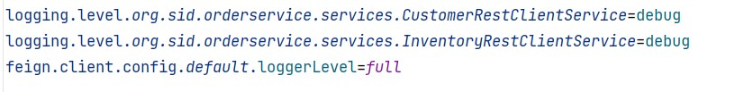

# 🚀 Microservices Magic with Spring Cloud

## Overview
Welcome to our enchanting microservices-based e-commerce application! Our journey is fueled by the mystique of technologies like Consul Discovery, Spring Cloud Config, Spring Cloud Gateway, Angular, and other magical services.

### 1. CONFIG SERVICE
#### Consul's Secret Gathering

### 2. CUSTOMER-SERVICE

#### Unveiling the Customer Realm

### 3. GATEWAY-SERVICE
#### Bean Enchantment

#### Gateway Incantations

#### Gateway Portals Unleashed

### 4. INVENTORY-SERVICE
#### Inventory Alchemy

### 5. ORDER-SERVICE
#### OpenFeign Configuration Spellbook

#### Order Service Full Order Enigma

### 6. BILLING-SERVICE with Consul Config and Vault
#### Vault Secrets and Consul Config Runes

### 7. FRONTEND ANGULAR
#### Customer Chronicles

#### Product Prodigy

#### Order Odyssey

#### Order Oracle

