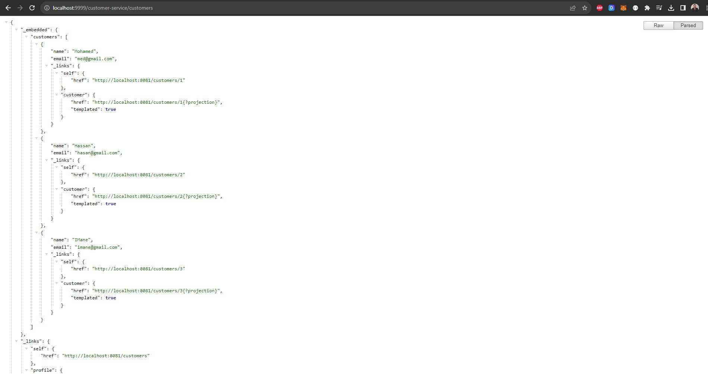

# Architecure-Microservice-avec-Spring-Cloud

## Overview
Welcome to our microservices-based e-commerce application! This project leverages various technologies, including Consul Discovery, Spring Cloud Config, Spring Cloud Gateway, Angular, and other specialized services.

### 1. CONFIG SERVICE
#### Consul Registered Services:

### 2. CUSTOMER-SERVICE

#### Customer Service Test

### 3. GATEWAY-SERVICE
#### Bean Configuration

#### Gateway Configuration

#### Gateway Test

### 4. INVENTORY-SERVICE
#### Inventory Service Test

### 5. ORDER-SERVICE
#### Configuration

### 6. BILLING-SERVICE avec Consul Config et Vault
#### Configuration with Vault

### 7. FRONTEND ANGULAR
#### Customers List

#### Products List

#### Orders List

#### Order Details

